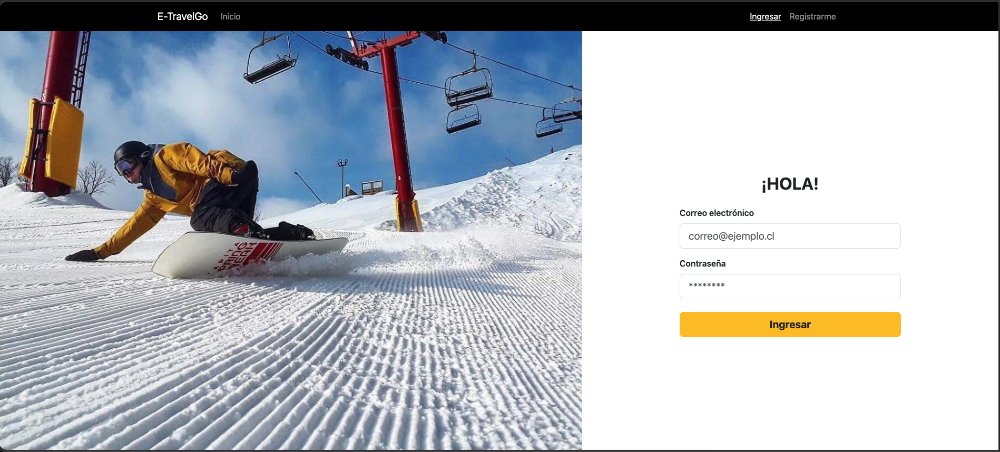
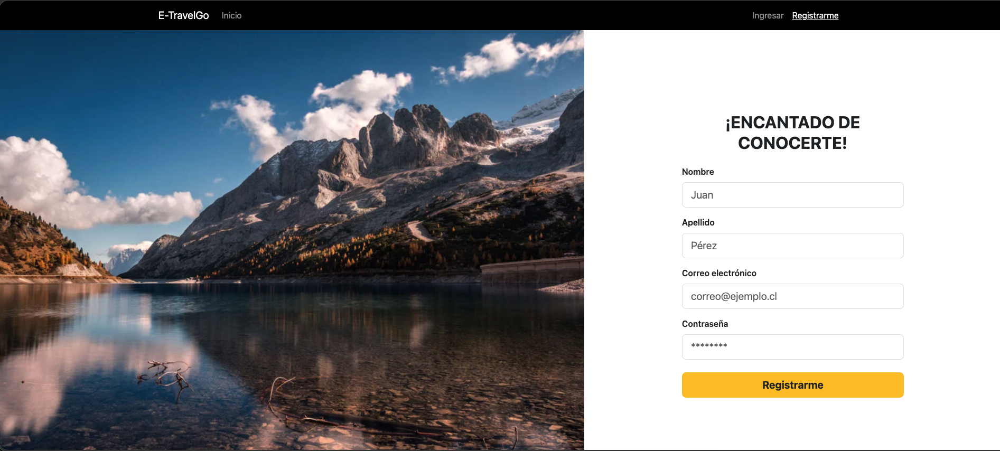

# ecommerce-m6

Link del repositorio: https://github.com/gNOR-mu/ecommerce-m6

# Propósito

Migrar el proyecto a Spring Boot, implementar registro e inicio de sesión con roles
(CLIENT/ADMIN), proteger rutas con Spring Security, conectar a BD con JPA o JDBC
Template y mantener el CRUD de productos (Admin). El foco es habilitar
autenticación/autorización y la capa web con controladores y servicios.

# Consideraciones

- Se utiliza MySQL
- Nombre de la base de datos: etravelgo
- Usuario db: root (cambiar si es necesario)
- Pass db: Root1234* (cambiar si es necesario)
- Para las vistas se ha utilizado Thymeleaf con: spring.thymeleaf.cache=false

Configuración del [application.properties](src/main/resources/application.properties):

```
spring.datasource.url =jdbc:mysql://localhost:3306/etravelgo
spring.datasource.username=root
spring.datasource.password=Root1234*
spring.datasource.driver-class-name=com.mysql.cj.jdbc.Driver
spring.jpa.hibernate.ddl-auto=update
```

# Compilación y ejecución

- Ejecutar con maven: ```mvn spring-boot:run```

- Construir JAR: ```mvn clean package```
- Ejecutar JAR: ```java -jar target/mvp_m6-0.0.1-SNAPSHOT.jar```

# Descripción de rutas

Tomando en cuenta que se ejecuta en el equipo local y puerto 8080 con ruta base http://localhost:8080/:

| URL                                       | DESCRIPCIÓN                                                                               | Restringido             |
|-------------------------------------------|-------------------------------------------------------------------------------------------|-------------------------|
| http://localhost:8080/                    | Página de inicio                                                                          | No                      |
| http://localhost:8080/login               | Página de inicio de sesión                                                                | No                      |
| http://localhost:8080/signup              | Página de registro de usuario                                                             | No                      |
| http://localhost:8080/                    | Página de inicio                                                                          | No                      |
| http://localhost:8080/products            | Página de todos los productos para el consumidor                                          | Sí (solo ADMIN, CLIENT) |
| http://localhost:8080/products/1          | Página de un producto en particular (id = 1), en donde el 1 corresponde a un PathVariable | Sí (autenticado)        |
| http://localhost:8080/cart                | Página para mostrar información del carrito de compras                                    | Sí (solo ADMIN, CLIENT) |
| http://localhost:8080/checkout            | Página para mostrar el resultado de la transacción del checkout                           | Sí (autenticado)        |
| http://localhost:8080/admin               | Página para mostrar el dashboard con las opciones disponibles de administración           | Sí (solo ADMIN)         |
| http://localhost:8080/admin/products      | Página de administración de productos                                                     | Sí (solo ADMIN)         |
| http://localhost:8080/admin/products/form | Página para crear o actualizar (si se accede desde /admin/products) un producto           | Sí (solo ADMIN)         |

# Objetivos de aprendizaje

- Crear y administrar un proyecto con Maven (POM, dependencias, ciclo de vida y
  empaquetado).
- Configurar Spring Boot/MVC: anotaciones, controladores, servicios y tecnología de vistas (JSP
  o Thymeleaf).
- Conectar datasource y acceder a datos con JPA (entidades/repositorios) o JDBC Template
  (DAO).
- Aplicar Spring Security: login, logout y roles para controlar acceso a recursos.
- Escribir pruebas básicas con Spring y empaquetar el proyecto.

# Alcance (MVP)

- Registro: formulario con nombre, apellido, email y contraseña; crea usuario con rol CLIENT en
  BD.
- Login/Logout: formulario de acceso con Spring Security.
- Autorización por rol:
  o CLIENT: acceso a páginas de catálogo y (al menos) visualización del carrito.
  o ADMIN: acceso a las páginas de administración de productos construidas en M5
  (listar/crear/editar/eliminar).

- Persistencia real: usuarios y productos en BD (usa JPA o JDBC Template, a elección del
  equipo).
- Vistas: mantener Bootstrap y adaptar a JSP o Thymeleaf según lo configurado en Spring Boot.
- Despliegue: aplicación ejecutable con Spring Boot; empaquetado según configuración del
  equipo.

# Requisitos funcionales

- Registro: valida campos requeridos y email único; crear usuario con rol CLIENT.
- Login: acceso con email/contraseña; al autenticar, redirigir por rol (CLIENT →
  catálogo, ADMIN → /admin/products).
- Acceso protegido:
    - Público: /login, /register, assets.
    - Solo ADMIN: rutas de /admin/**.
    - Autenticado (CLIENT/ADMIN): catálogo y vistas de usuario.
- Admin de productos: reutiliza el CRUD del módulo anterior bajo /admin/**.
- Mensajería: mostrar mensajes claros de validación/errores en las vistas.

# Requisitos técnicos

- Maven: POM con dependencias de Spring Boot (web, security y JPA o JDBC),
  empaquetado y ejecución.
- Spring Boot/MVC: controladores con anotaciones, paso de datos a vistas, servicios
  inyectados con @Autowired.
- Vistas: JSP o Thymeleaf (una sola tecnología, consistente en todo el proyecto).
- Datos (elige una de las dos líneas, ambas válidas en el módulo):
    - JPA: entidades + repositorios; operaciones CRUD.
    - JDBC Template: DAO por entidad con consultas parametrizadas y mapeo a
      DTO/clases de modelo.

- Spring Security: configuración básica, formulario de login, logout y restricción por
  roles en controladores/vistas.
- Pruebas: al menos 2 (por ejemplo, servicio de usuarios y acceso restringido a una
  ruta).
- Empaquetado: ejecutar con Spring Boot; si corresponde, empaquetar WAR.

# Credenciales

Credenciales válidas para iniciar sesión (creadas al iniciar la aplicación):

| ROL    | EMAIL              | CONTRASEÑA |
|--------|--------------------|------------|
| ADMIN  | admin@email.cl     | admin1234  |
| CLIENT | user@email.cl      | user1234   |
| CLIENT | firstClient@mvp.cl | firstmvp   |

# Algunas capturas




